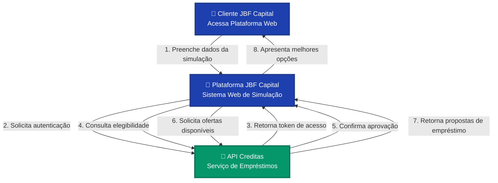
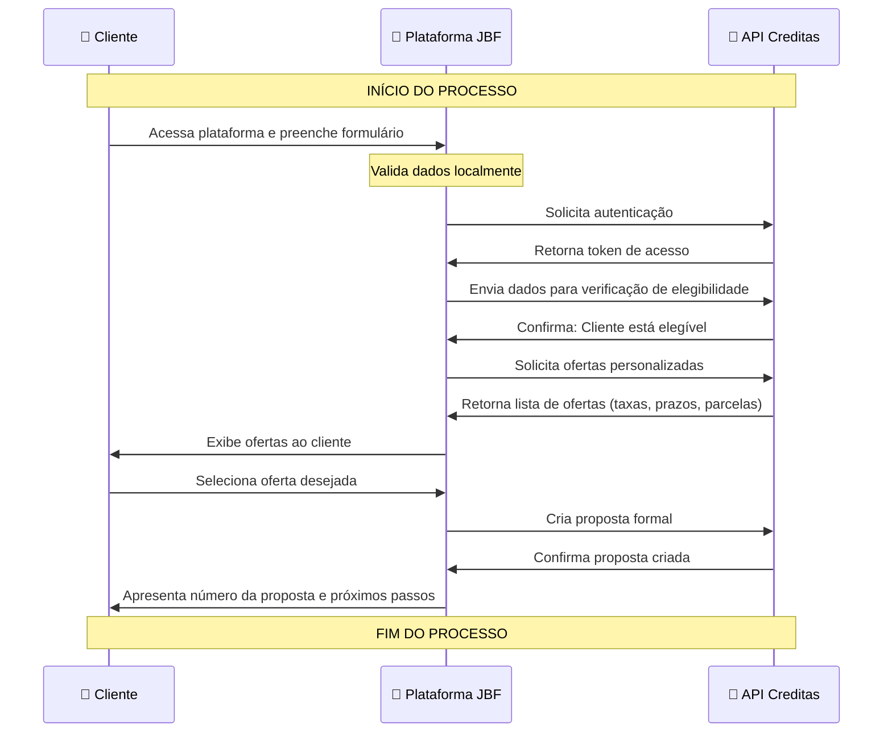

# Diagrama de Integração - APIs JBF Capital

## Visão Executiva do Fluxo de Integração

Este diagrama apresenta de forma simples como nossa plataforma JBF Capital se conecta com a API da Creditas para oferecer simulações de empréstimo Home Equity aos nossos clientes.

---

## Fluxo Principal de Integração

---

## O Que Acontece em Cada Etapa

### 1️⃣ **Cliente Inicia Simulação**
O cliente acessa nossa plataforma web e informa:
- Valor do imóvel
- Valor desejado do empréstimo
- Prazo de pagamento

### 2️⃣ **Autenticação Segura**
Nossa plataforma se conecta de forma segura com a API da Creditas usando credenciais autorizadas.

### 3️⃣ **Verificação de Elegibilidade**
Consultamos se o cliente pode solicitar o empréstimo baseado nos dados informados.

### 4️⃣ **Busca de Ofertas**
Solicitamos as melhores opções de empréstimo disponíveis para o perfil do cliente.

### 5️⃣ **Apresentação de Resultados**
O cliente visualiza múltiplas ofertas com:
- Valor da parcela mensal
- Taxa de juros
- Prazo total
- Custo total da operação

---

## Componentes do Sistema

| Componente | Descrição | Responsabilidade |
|------------|-----------|------------------|
| **🏢 Plataforma JBF Capital** | Sistema web responsivo | Interface com cliente e gerenciamento de solicitações |
| **🔗 API Creditas** | Serviço externo de empréstimos | Processamento de elegibilidade e geração de ofertas |
| **👤 Cliente** | Usuário final | Inicia processo de simulação |

---

## APIs Integradas

### 🔐 **API de Autenticação**
- **Finalidade**: Garantir acesso seguro ao sistema
- **Requisição**: Credenciais da JBF Capital
- **Resposta**: Token de acesso temporário

### ✅ **API de Elegibilidade**
- **Finalidade**: Verificar se cliente pode solicitar empréstimo
- **Requisição**: Dados do imóvel e valor desejado
- **Resposta**: Aprovado ou não aprovado

### 💰 **API de Ofertas**
- **Finalidade**: Buscar melhores condições de empréstimo
- **Requisição**: Perfil do cliente e valor solicitado
- **Resposta**: Lista de ofertas personalizadas

### 📝 **API de Proposta**
- **Finalidade**: Formalizar interesse do cliente
- **Requisição**: Oferta escolhida e dados completos
- **Resposta**: Número da proposta e próximos passos

---

## Fluxo Detalhado de Dados

---

## Benefícios da Integração

✅ **Agilidade**: Resposta em tempo real para o cliente  
✅ **Precisão**: Ofertas baseadas em dados reais e atualizados  
✅ **Segurança**: Comunicação criptografada entre sistemas  
✅ **Escalabilidade**: Capacidade de atender múltiplos clientes simultaneamente  
✅ **Transparência**: Cliente vê todas as opções disponíveis  

---

## Tecnologias Utilizadas

- **Plataforma Web**: HTML5, CSS3, JavaScript
- **Protocolo**: HTTPS (comunicação segura)
- **Formato de Dados**: JSON (leve e eficiente)
- **Autenticação**: OAuth 2.0 (padrão de mercado)

---

## Resumo Executivo

Nossa integração com a API da Creditas permite que clientes JBF Capital tenham acesso instantâneo a simulações de empréstimo Home Equity de forma totalmente digital e segura. O processo é rápido, transparente e oferece múltiplas opções para o cliente escolher a que melhor se adequa ao seu perfil.

**Tempo médio de resposta**: Menos de 2 segundos  
**Disponibilidade**: 24/7  
**Segurança**: Criptografia de ponta a ponta  

---

*Última atualização: Janeiro 2026*  
*JBF Capital © 2026 - Todos os direitos reservados*
